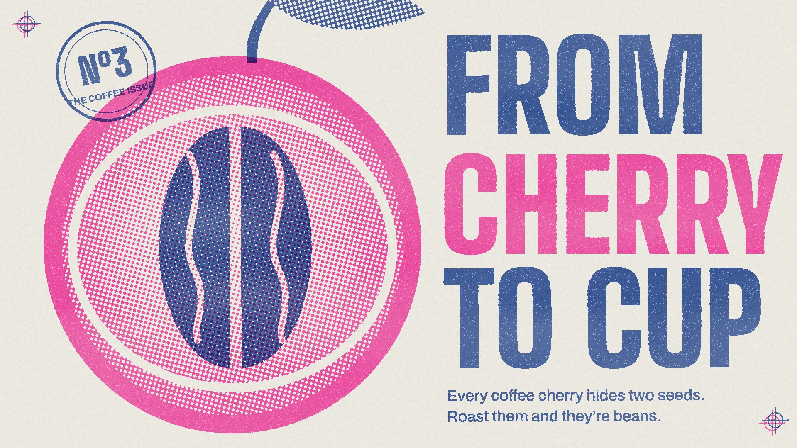

# 01 Riso zine

**What it is:** a two-ink risograph print. Fluorescent Pink (`#FF48B0`) and Medium Blue (`#3255A4`) on uncoated
off-white stock; where they overlap they multiply to a deep purple. Big condensed type, a single bold cut-away
illustration, a rubber-stamp badge, registration marks. Zine energy, slightly punk, very warm.

**Fits:** launches with personality, food and drink, culture, community, events, indie products, anything that
should feel made by people. Less good for sober corporate or data-dense content.

## Build (template: `assets/styles/01-riso-zine/still.html`)
- **Draw each ink as its own layer** (a canvas whose alpha = ink density 0..1). Solids at 1, tints as partial alpha.
- **Screen each layer with its own halftone angle** (pink 15°, blue 75°, cell ~11 px): a pixel inks if
  `density > 1 - (0.5 + 0.25(cos u + cos v))` in the rotated grid. Solids stay solid.
- **Imperfections are the style:** speckle voids in solids (~3.5%), roller unevenness (low-frequency noise
  0.82–1.0 across the sheet), paper grain, **misregistration** (offset one plate ~7,-5 px plus a hair of rotation).
- **Composite by multiply onto paper** per channel: `paper *= 1 - coverage * (1 - ink/255)`.
- Knock-outs (the bean crease, the parchment ring) are erased from a layer, so paper shows through both inks.
- Type: one condensed display face (Big Shoulders Display 900) set huge, split across the two inks; one short
  line in a plain grotesk. A stamp badge and registration crosses are the only extras.

## Motion
Stepped at 12 fps. Each "impression" re-rolls speckle and shifts registration by a pixel or two (the print
breathes). Elements arrive by plate: blue plate lands, then pink overprints with a register snap. Transitions: a
new sheet slides over, or the drum rolls ink on in a band.

## Sound
Riso drum whir + paper feed thunk per impression, a scrappy drum machine or lo-fi guitar loop.

## Pitfalls
- Don't fake riso with a colour filter or a halftone overlay on a normal image: the plates must be separate.
- Keep to two (max three) inks; a third ink should be a real riso colour (Yellow `#FFE800`).
- Registration offset of 0 kills it; 20+ px looks broken.
