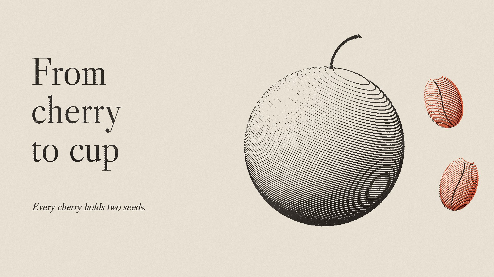

# 02 Engraved plate

**What it is:** a line engraving printed on cream paper, like a plate from an old natural-history book, with
one modern gesture: the subject's key element (here the two seeds) printed in a single vermilion spot ink,
slightly off register. One large Caslon title, one italic line, and nothing else.

**Fits:** science, origins, craft, heritage, premium products, anything that deserves to look studied and
precise. Quiet and confident.

## Build (template: `assets/styles/02-engraved-plate/still.html`, uses `lib/print.js`)
- **Engrave forms as latitude lines** of a tilted sphere/ellipsoid: walk circles about an axis, project them, and
  set each segment's width by how much it faces away from the light: `w = wMin + (wMax - wMin)(1 - lit)^1.6`.
  Thick in shadow, hairline in light, and let lines break out in the brightest highlight (with a jittered
  threshold, or the highlight becomes a hard hole).
- A firm contour only on the shadow side; stems as a few parallel burin strokes.
- Two plates through `printPlates`: black key (fine cell, `solidAt` ~0.45 so line edges print crisp) and one
  spot plate offset 3-5 px. Paper: cream `[239,232,218]`, no ageing specks (they read as dirt).
- Type: Libre Caslon Display, large; one italic line. That's it.

## Motion
The burin draws the lines on one after another (latitude by latitude, top to bottom), then the plate is inked
and the spot colour lands with a small register settle. Long holds; slow push-ins on the engraving.

## Sound
Burin scratch per line (thin band-passed noise), a press thud when the spot colour lands, a solo cello or
harpsichord figure.

## Pitfalls (this style was rejected twice before it was kept)
- White-line engraving on black, plus mono header/footer rows, crop-mark grids and leader-line labels = "AI slop".
  The engraving was loved; everything around it had to go.
- More than one spot colour, or colour on the main subject, turns it into an illustration.
