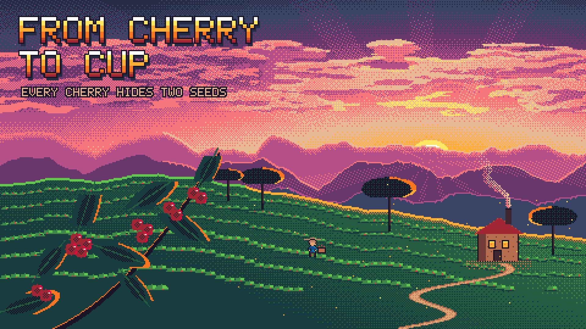

# 04 Pixel diorama

**What it is:** a whole tiny world in 16-bit pixel art at golden hour: layered hazy ranges, a terraced hill,
shade trees, a winding path, a roastery with smoke, a picker at work, a backlit branch in the foreground,
a banded pixel wordmark. Native 480×270, one fixed palette, upscaled ×4 nearest-neighbour.

**Fits:** games, playful systems, processes that have a "world" (supply chains, pipelines, towns of services),
nostalgia, anything that can be shown as a place where small things happen.

## Build (template: `still.html`; animation `anim.html`)
- **One palette, no blending**: Endesga-32. Every pixel is a palette index; colour ramps are palette steps with a
  4×4 Bayer dither between them (`t*16 > B4[y&3][x&3]`).
- **Light story first**: a low sun, sky ramp brightening toward it, clouds lit on the sun side, rim light on every
  silhouette edge that faces the sun (ridges, tree crowns, leaves, cherries), long shadows away from it, god rays
  as a sparse one-step brightening in angular wedges. Check the rim is on the correct side for objects on both
  sides of the sun.
- **Depth by layers**: far ranges hazed to the sky colour, mid hill with terrace rows (bushes as tiny lit blobs
  with red dots for fruit), foreground branch dark and backlit.
- **Real v1 lesson**: the first version (flat 320×180, few layers, lit evenly) was "SOOO much better possible".
  What fixed it: higher native res, one strong light source, atmospheric layering, a foreground silhouette.
- Title: 5×7 bitmap font (`lib/font5x7.js`) ×3 with a vertical colour band, 1-px outline and drop shadow.

## Motion (`anim.html`, 12 fps, 10 s) — stepped, never tweened
- Camera trucks 1 px every 5 frames; layers parallax at integer ratios (1/8 … 1/1).
- The sun sinks 1 px/s and the sky, rims and rays re-grade each step; clouds drift; rays turn in notches.
- Smoke loops, cherries glint on 2s, leaves sway between 5 discrete poses, a window flickers.
- Characters: sprite with a 4-frame walk cycle and scripted actions (the picker stops, reaches, tosses a cherry
  on a pixel arc into the basket, which fills). A title glint sweeps every 3 s.
- `window.renderFrame(f)` must be deterministic; floor every coordinate before indexing the dither matrix.

## Sound (`sound.py`) — 2A03-style chiptune at 120 BPM (1 beat = 6 frames)
Pulse lead (25% duty, delayed vibrato + echo channel), 12.5% arpeggio 16ths, triangle bass, noise-channel drums;
SFX from the same schedule: toss blip + plink per pick, footsteps on the walk cycle, sparkles on the glint,
crickets as the sun sets. Keep triangle bass modest (it dominates after loudness normalisation) and high-pass 35 Hz.
