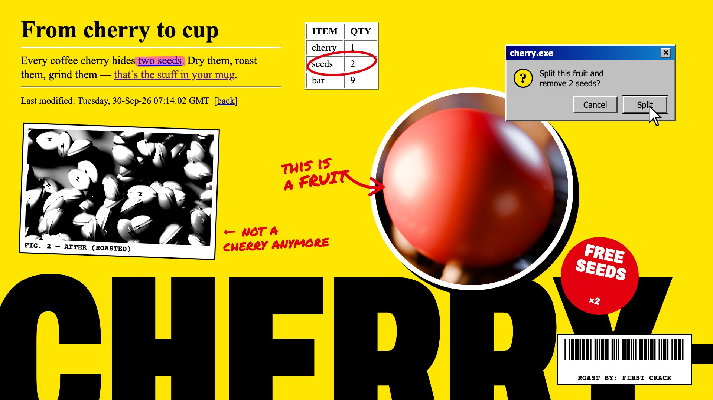

# 07 Brutal editorial

**What it is:** a Businessweek-cover collision on a flat safety-yellow page. Registers that shouldn't meet, meet:
raw 1996 HTML (Times, default link blue and visited purple, bevelled `
`, a `border=1` table), a Windows 95
dialog with a cursor about to click, a giant cropped condensed grotesk bleeding off the bottom, a round photo
cut-out sticker, a xeroxed figure with a typewriter caption, red marker annotations and arrows, a price starburst,
a barcode. Nothing centred.

**Fits:** tech launches with a sense of humour, developer tools, media, anything irreverent or opinionated.

## Build (template: `still.html`; plates via the Blender scripts in the same folder)
- HTML/CSS is the right tool: the registers *are* web/OS artefacts. Use the real idioms (default link colours,
  outset/inset borders, `#000080 → #1084d0` title bar, `MS Sans Serif`/Tahoma, bevel buttons, a default button
  outline).
- The photo elements must be real photographs of the subject (here two Blender plates: a macro cherry, and a
  top-down deep-focus bean plate for the xerox). Xerox = grayscale, contrast ×2.6, crop on sharp detail.
- Annotations in Permanent Marker, red `#e3000f`, with hand-drawn SVG arrows and a circled table cell.
- Giant type: Archivo at width 62% and weight 900, 640 px, cropped by the frame.

## Motion
Hard cuts and jump-zooms; elements are *pasted in* (0 → 1 in one frame with a 2-frame overshoot); the cursor moves
in straight lines and clicks (the dialog button depresses); marker strokes draw on fast; the giant word slides in
from the edge on a cut.

## Sound
Mouse clicks, Windows-ish dings, a photocopier pass for the xerox, marker squeaks, a punchy breakbeat.

## Pitfalls
- The first version (bento cards, 5 px borders, hard offset shadows, pastel fills) read as the generic
  "neo-brutalism" template. Collage of real registers is what makes it editorial.
- Don't blur the crop of the photo into bokeh; the xerox needs sharp texture.
