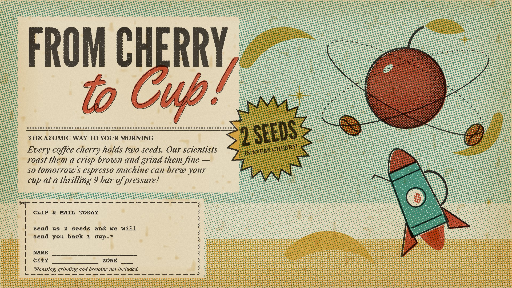

# 09 Space Age

**What it is:** not "retro-futurism" as a vector costume but the artefact itself: a 1958 magazine ad, letterpress
printed in four spot inks (black key, tomato, mustard, turquoise), each with its own halftone angle and slightly
out of register, on yellowed newsprint. Googie shapes (boomerangs, Sputnik stars, orbits), a percolator-rocket,
a cherry-planet with bean moons, deadpan ad copy in italic Caslon, a starburst sticker, a clip-and-mail coupon.

**Fits:** optimistic launches, "the future of X", consumer products with humour, anything with a promise.

## Build (template: `still.html`, uses `lib/print.js`)
- Four plates (`makePlate`), each drawn with alpha = density: tints as partial alpha so they halftone; solids solid.
- Knock paper panels out of the tint plates (`clearRect`) where copy sits, like a real ad layout.
- `printPlates(..., {age: 1})`: yellowed paper, darker edges, foxing. Offsets per plate of 2-5 px.
- Type stack of the era: League Gothic headline, Yellowtail script with a black keyline under the red, italic
  Caslon body copy, a small caps kicker, Courier for the coupon. The copy is deadpan and a bit absurd.
- Objects on orbits: compute positions on the ellipse, don't eyeball them; draw back halves dashed, front solid.

## Motion
Limited animation in the UPA tradition: held poses, objects slide on straight paths, stars twinkle on 2s, orbits
turn, the camera trucks slowly across the page. Each held frame re-rolls the halftone jitter slightly.

## Sound
Vintage library music (vibraphone, bongos, walking bass), a theremin swoop for the rocket, a mid-century announcer
cadence if there's voice.

## Pitfalls
- The first version (smooth vectors, flat teal, generic atomic shapes) needed work. The print process, era type and
  ad structure are what make it convincing.
- Stray decorative lines that don't attach to anything read as mistakes; remove them.
