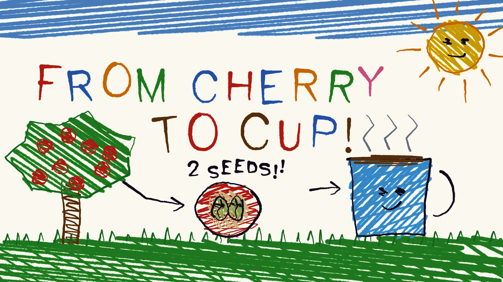

# 10 Naive doodle

**What it is:** an actual child's crayon drawing. Wax crayon strokes with paper tooth, outlines that don't close,
zig-zag colouring that misses and overshoots the lines, a sky strip at the top with the white gap below it
(how kids draw sky), a smiling sun in the corner, grass tufts, faces with dot eyes, letters drawn stroke by stroke
in changing colours, a big arrow and "2 SEEDS!!".

**Fits:** children, education, families, warmth, humility, "simple explanation of a complex thing", non-profits.

## Build (template: `still.html`; p5.js + p5.brush from CDN, `lib/hershey.js`)
- **Use p5.brush pigment strokes, not vector wobble.** A custom `crayon` brush (weight 5, scatter 0.6, grain 7,
  noise 0.55, opacity ~205) and a `fatcrayon` for big fills. Rough.js-style vector wobble read as "my toddler is
  an AI" and was rejected.
- Outlines are 2 overlapping strokes that start late and overshoot (`kidOutline`); resample paths and push each
  point along a slow noise so the hand wobbles.
- Colouring = zig-zag scanlines across the shape at an angle, ends that miss (+14 px) or overshoot, sometimes
  stopping halfway ("got bored"), and an occasional second pass at a shallow angle (not a neat crosshatch).
- Lettering: single-stroke Hershey glyphs (`futural`), each letter with its own scale, baseline drop and tilt,
  colours cycling; tracking loose. Faces: scribbled-dot eyes, one curved mouth, blush ovals.

## Motion
Boiling line on 2s (reseed the jitter 12×/s), things bounce with big squash, the drawing appears in the order a
child would draw it (sun first, then the big thing, colouring last, scribbled fast).

## Sound
Crayon-on-paper scratch per stroke, a kazoo/xylophone/ukulele tune, a kid's "ta-da" moment.

## Pitfalls
- Anything symmetrical, evenly spaced or perfectly closed breaks the illusion.
- Use a real single-stroke font: a handwriting webfont reads as a font.
