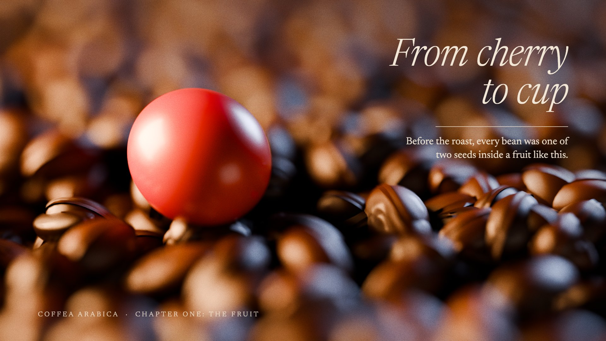

# 11 Tactile editorial

**What it is:** a full-bleed macro "photograph" rendered in Blender: one ripe cherry resting in a bed of roasted
beans, 100 mm at f/2.8, low warm window light, falloff into shadow, bokeh behind. Over it, one quiet italic serif
title in cream, a hairline rule, one line of copy, one small uppercase metadata line, a breath of film grain.
This is the skill's `style-tactile-editorial.md` direction made concrete, and the reviewer's favourite
("I don't know how you did this one, but looks amazing").

**Fits:** premium launches, food, materials, brand films, title sequences, essays.

## Build (templates: `11-tactile-macro.py` Blender scene → plate; `still.html` composites type + grain)
- Model at real-world scale (beans ~11 mm, cherry ~16 mm) so the lens and DOF behave physically.
- Beans: one shared mesh (two bisected half-ellipsoids with a gap = the centre cut, flattened underside),
  instanced ~3,400× with jittered transforms, per-object random roast colour (`#2a150b → #5a321b`), fine bump,
  a little coat for oil sheen.
- Cherry: slightly elongated ellipsoid, colour ramp crimson → orange toward the stem end, subsurface, waxy (rough
  0.34, light coat), calyx ring at the blossom end.
- Light: one warm area light low from the side (window), weak cool rim, very dark world. AgX High Contrast,
  exposure -0.2. Camera 100 mm, raised enough to see into the bed, focus on the cherry.
- Composite in HTML: plate full-bleed, a soft gradient behind the type only, grain at ~16% overlay (55% was far
  too heavy). Newsreader italic 300 for the title.
- Render on the strongest GPU available (`assets/blender/remote.sh`); 384 spp at 1080p took ~14 s on an RTX 5070 Ti.

## Motion
Light and time only: slow push (1-3%/s), rack focus from bokeh to the cherry, re-grades (morning/noon/night),
fades from black. Nothing bounces. See `style-tactile-editorial.md`.

## Sound
Room tone, a close foley texture (beans pouring), a sparse piano or cello; silence is allowed.

## Pitfalls
- Don't claim "1:1 macro" or other technical metadata you can't back up.
- The first cherry was too smooth and ball-like: add the elongation, colour ramp and calyx.
