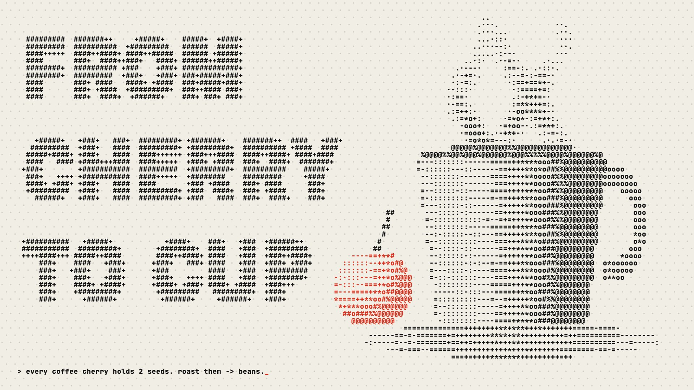

# 12 Coded ASCII

**What it is:** the whole frame is one character grid on a light paper ground, in black with one red. Objects are
procedural fields (a lit sphere, an SDF-shaded tapered cup, fbm steam) quantised to a density ramp
`' .·:-=+*o#%@'`; silhouettes get edge glyphs chosen by gradient direction (`| / - \`); the title is rasterised
into the same grid (`#` inside, `+` on the edge); empty cells hold a faint checkerboard of `·`. The reviewer
asked for this one to become a website ("so fucking cool").

**Fits:** developer tools, infrastructure, AI, data, terminals, anything "code" that should not look like neon
cyberpunk. Light ground is essential: this is the anti-Matrix.

## Build
- Still: `still.html`. Grid of CW×CH cells (12×20 px at 1080p); shade each cell from the scene function; pick glyph.
- **Website: `site/index.html`** (open it directly; M = music, T = theme, click = stamp a bean):
  - scroll-driven story in 6 chapters (cherry splits → drying bed with a rake → roaster drum with first-crack
    pops → grinder → espresso pour), each a field function of (X, Y, time, chapter progress);
  - chapters dissolve through an 8×8 Bayer matrix; chapter nouns are giant glyph-art words; captions type into
    the grid; hidden semantic text for screen readers; 4 themes are colour tokens; ~16 ms/frame;
  - **ASCII needs objects at least ~8 rows tall to read** (the first drying bed and roaster were illegible).
  - background music: `site/audio/loop.mp3`, gapless 8-bar loop (see `music-and-sound.md`), not scroll-reactive.
- Demo video: `site_render.py` captures the site deterministically (virtual clock + scripted scroll/pointer/keys)
  and logs chapter, progress, typed characters and theme per frame; `sound.py` builds the reactive score from it.

## Motion
Fields evolve per frame (noise time), glyphs flip in place; nothing translates smoothly. Transitions = dither
dissolves. Pointer adds heat; clicks stamp a bitmap that blooms and dissolves through the dither.

## Sound (reactive, `sound.py` + `lofi.py`)
Lo-fi at 84 BPM rendered per layer; per chapter, layers enter/leave (hero: filtered keys + crackle → full
groove → cup: drums drop, warm resolve); a low-pass opens with scroll speed. SFX from the log: a key click per
typed character, stamp thump + chime, filtered swells on dissolves, relay clicks on theme change, cherry snap,
rake, roaster rumble + first-crack pops (same burst schedule as the page), grinder, pour.
