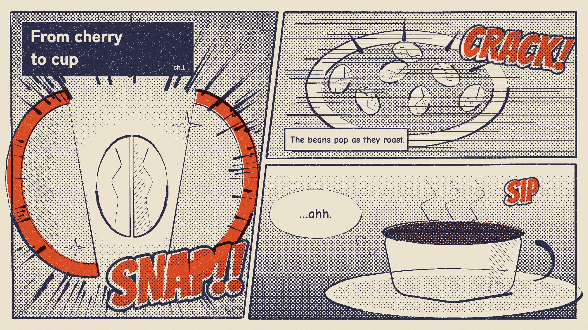

# 14 Printed manga

**What it is:** a three-panel manga page, *printed*: an ink plate hand-inked with a G-pen (tapered strokes,
freehand borders, hatching that breaks), a tone plate screened as real halftone (dot size follows the tone value,
gradients become screentone), and one vermilion spot plate out of register for the sound effects and key
accents; navy-black ink on cream stock with speckle. Speed lines, SFX lettering (SNAP!! CRACK! sip), a chapter
box, caption box, speech bubble. Reference: printed-manga music videos with 2-3 spot inks.

**Fits:** energetic explainers, step-by-step stories with a punchline per step, anything with action beats.

## Build (template: `still.html`; p5.js + p5.brush from CDN)
- Ink plate: p5.brush custom pens (`gpen` pressure [1.35, 0.35], `hatchpen`, `speed`, `brushpen`, `border`).
  Outlines = 2-3 overlapping strokes that don't quite meet; hatching = short parallel strokes, lengths varied,
  ~30% broken in the middle. Main outlines heavy (~3), details lighter.
- Speed lines: tapered wedges (thin at the focus), clipped to the panel polygon (Cyrus-Beck), never over gutters.
- Tone plate: grey levels + gradients per panel, knocked out of text boxes (tone behind text makes "pop" read "pap").
- Spot plate: vermilion `[236,84,44]` for SFX fills and the cherry skin; SFX = heavy black keyline + white gap +
  colour fill, left-aligned per glyph (mixed alignment misregisters the keyline).
- Composite: ink/tone as navy multiply, spot offset 5,-3, paper `[239,230,210]`.

## Motion
Camera cuts panel to panel (push into each), holds, smash-cuts; impact frames flash inverted for 2 frames;
speed lines re-seed on 2s; SFX pop in with a 2-frame overshoot.

## Sound
Foley exaggerated to manga scale (snap, crack, sip), whoosh on each panel cut, a taiko hit on impact frames.

## Pitfalls
The first version (clean SVG, perfect lines, flat tone) read "so perfectly drawn". The pen pressure, broken
hatching and printed plates are what sold it.
