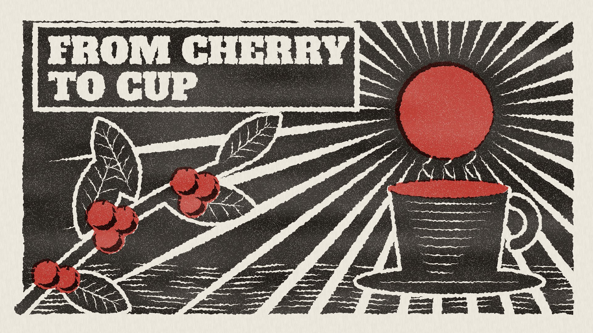

# 15 Linocut

**What it is:** a carved relief print in two inks, red block first, black key block on top, slightly out of
register. Everything white is *carved away*: tapered gouge strokes for the sun's rays, wavy gouges for the ground,
white halo outlines around solid shapes (branch, leaves, cup), veins, hatching on the cup, steam, a carved title
panel. Rough ink transfer, speckle voids, uneven roller, paper grain. The reviewer's top pick ("NAILED IT").

**Fits:** origins, craft, food, agriculture, labour, heritage, folk stories, anything honest and handmade.

## Build (template: `still.html`)
- Key block: fill the whole block (with a slightly irregular edge), then **carve with `destination-out`**.
- `gouge(x1,y1,x2,y2,w,bow)`: a lens-shaped cut (two quadratic curves) — tapered at both ends like a real V-gouge.
- The lino outline trick: carve a halo around each solid shape (wide stroke `destination-out`), then re-ink the
  shape itself (`source-over`), then carve its details (veins, hatching) inside it.
- Red block: only the sun, cherries (holes carved in the key so red prints into them, with black shadow
  crescents added back) and the coffee.
- Ink transfer: sample the plate at a noise-jittered position (rough edges), roller unevenness, 3-8% speckle voids.
  Multiply red then black onto paper, black offset ~5,3 px.

## Motion (`anim.html`, 12 fps, 10 s) — three acts
1. **Carve** (0-4 s): gouges in drafting order: title letter by letter, sun, rays, ground, halos, veins, cherries,
   cup, steam. Each frame shows the proof of the block so far.
2. **Stamp** (4.0 s): the red block lands ~22 px out of register with a 2-frame shake, settles in 6 frames.
3. **Living print**: a fresh impression every 2 frames (speckle + register jitter re-roll), rays turn a notch,
   steam gouges rise, a cherry falls on a gravity arc into the cup with a red crown splash (keep droplets below
   the sun: red on red disappears).

## Sound (`sound.py`)
A gouge/chisel sound per cut from the same carve schedule (voice per stage: chisel for letters, long scrape for
the sun, short ones for rays and ground), lino room tone that ducks before the stamp, a heavy thud + paper slap at
4.0 s, then a folk groove at 90 BPM whose 16ths = the 2-frame impressions (palm-muted pluck ostinato, plucked bass
with release, press clack on 2 and 4, kalimba melody), whoosh → plop + droplets for the cherry.
