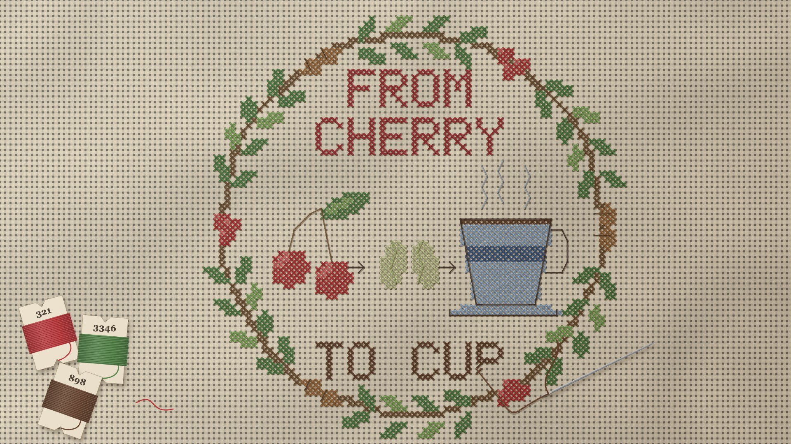

# 16 Cross-stitch

**What it is:** a sampler stitched on Aida cloth. Every X is two floss strokes (bottom leg / then top leg \, always
in that order, like a real stitcher), each lit with a darker edge, a sheen line, a ply twist and a cast shadow into
the cloth. Outlines and steam in backstitch. The frame is a *stitched wreath* (cross-stitched vine, laurel-paired
leaves, cherry clusters, roasted-bean pairs), the title in a 5×7 stitch alphabet, the story row
(cherries → seeds → cup), and the last letter left unfinished with the needle and thread still in it.
Props: floss card bobbins with numbers, a snipped thread tail.

**Fits:** home, care, family, heritage, craft brands, patience, "made with love", slow-living products.

## Build (template: `still.html`, uses `lib/font5x7.js`)
- Pattern = a cell grid (70×70 + margin) filled by motif helpers (`text`, `disc`, `ell`) with floss colours.
- Cloth: per-pixel woven blocks (raised centres), holes at every corner, fibre noise, gentle folds. Cache it.
- `thread()` draws one lit floss stroke (shadow, body, lighter core, sheen, ply ticks). Backstitch runs hole to
  hole, diagonals allowed (a stepped outline around a stepped fill looks wrong).
- Unfinished work: remove the last few stitches of the final letter, leave two as half-stitches, run the needle's
  thread into the last hole.

## Motion (`anim.html`, 12 fps, 10 s)
Stitch ops (1,525 of them) ordered by motif, each group with its own frame budget, eased: wreath around from the
top (0.3-2.7 s), title letter by letter (2.8-4.8), story row left to right (5.0-7.5), TO CUP (7.6-8.8). The needle
leads, pointing into the latest hole, thread sagging from its eye back to the work; it comes to rest at 8.9 s,
matching the still.

## Sound (`sound.py` + per-frame stitch counts in `16_events.json`)
Needle pierce (tiny fabric pop) + thread pull (soft swish) at hand speed while stitching, busier when more stitches
land; longer pulls for backstitch; scissors snip at each colour change (the pauses between motifs); a small metal
tick as the needle is set down; a music-box waltz in D at 108 BPM, 3/4.

## Pitfalls (from review)
- The wooden hoop read as bland and AI-made: the frame should be stitched too.
- Flat ellipse "skeins" read as eyes: props must be instantly recognisable objects (card bobbins).
- Sparse evenly-spaced border Xs look generated; a continuous motif (vine + leaves + fruit) looks designed.
