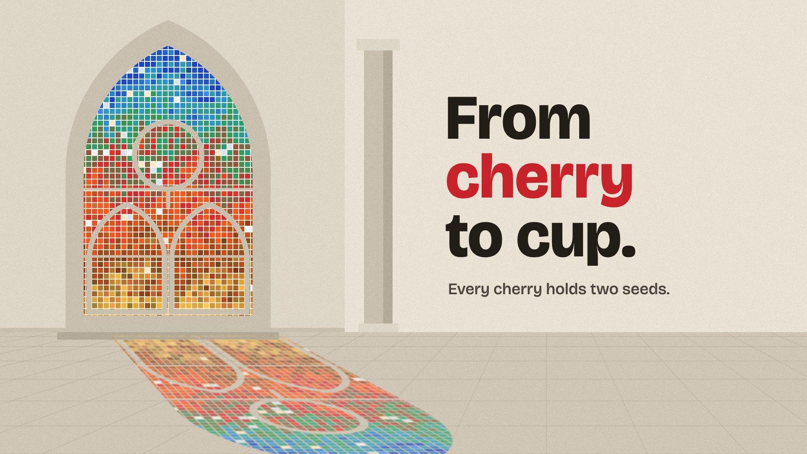

# 17 Stained glass

**What it is:** a flat, graphic cathedral in daylight on pale stone. A gothic lancet (two lights, an oculus,
saddle bars, stone tracery) glazed with small Richter squares (after Gerhard Richter's Cologne Cathedral window)
whose colours run a Sagrada Família-style gradient top to bottom that tells the story: sky blue, leaf green, cherry
red, ember orange, roast brown, crema gold. Its coloured light lands on the floor as the exact projection of the
glass. One title (Bricolage Grotesque, "cherry" in red), one line.

**Fits:** anything about light, transformation, revelation, ritual, spaces, architecture, "the whole journey in
one image". Calm and radiant.

## Build (template: `still.html`)
- **The glass layer is the single source of truth.** Fill squares over the window's bounding box (colour from the
  gradient + jitter, snapped to a fixed palette, a few pale quarries), then `destination-in` the smooth arch path
  and `destination-out` the tracery strokes. Edges are smooth because the arch clips them.
- **The cast is that layer projected**, one horizontal slice per floor row (window bottom → near the wall, window
  top → far into the room), scaled and sheared for the sun angle. Every bar, the oculus and the pointed arch
  reappear in the cast. On a light floor: brighten the lit area first, then multiply the glass colours at ~0.78.
- Stone: flat shapes in 3 tones (wall, reveal, shadowed jamb/column side), perspective floor joints, paper grain.
- The pointed arch: two arcs of radius 0.8 × width (0.95 gives an apex that runs off frame).

## Motion (`anim.html`, 24 fps, 10 s — smooth because it's light)
The sun comes out (0.2-2.2 s): glass brightens, the cast fades in from soft to sharp; the cast shears and slides
as the sun moves; ~3.5% of squares flicker to a variant colour per half-beat; a cloud passes (5.9-7.9 s) and dims
glass + cast; the type fades up with the light.

## Sound (`sound.py`) — follows the same light curve
Organ-like additive pad (D → G/D → A/D) whose level and low-pass open with the light and close under the cloud;
tubular bells when the light arrives (2.2 s) and returns (7.9 s); faint glass chimes on flicker beats; wind under
the cloud; large stone-room reverb.

## Pitfalls (from review)
- The first 3D (Blender) nave was fine, but the brief was a flat *digital* cathedral with type beside it.
- The dark version (black nave, glowing Cinzel title, mono location label, palette strip, stats line) was
  "AI slop" even though the glass was good.
- A cast built from separate data had blocky edges under smooth glass: derive it from the glass layer.
